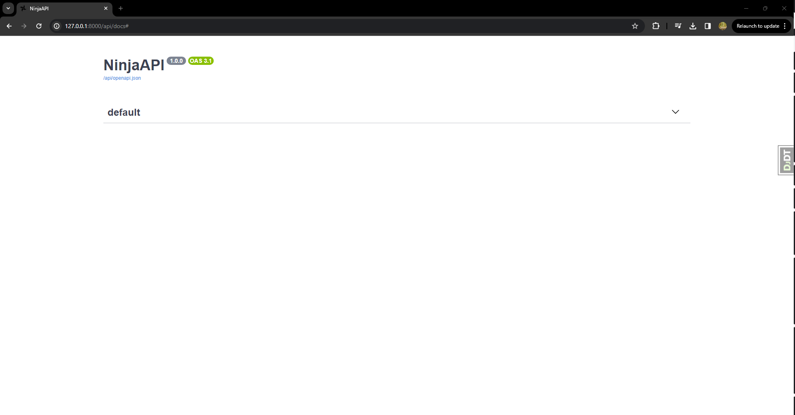
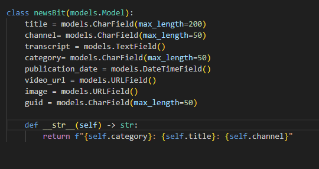
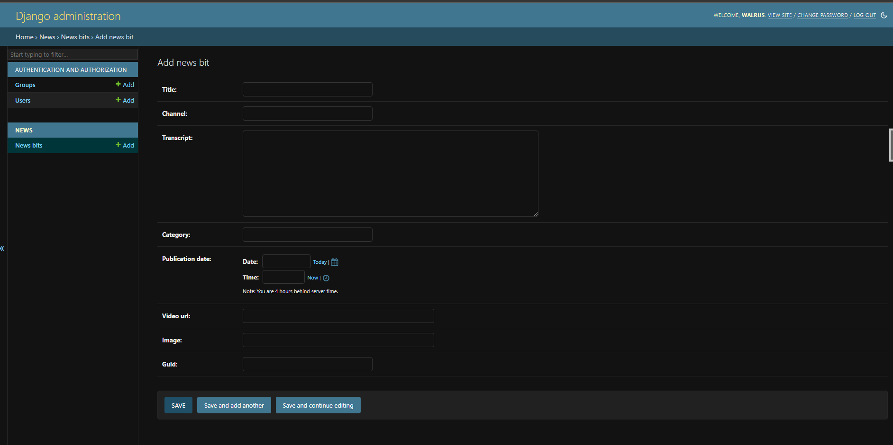
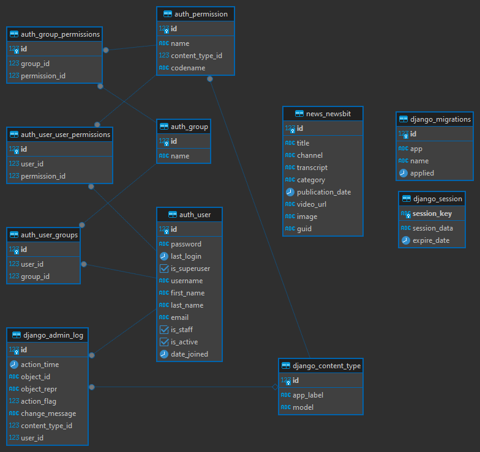
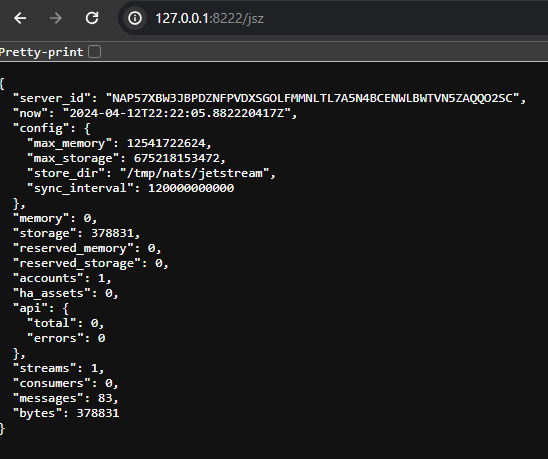
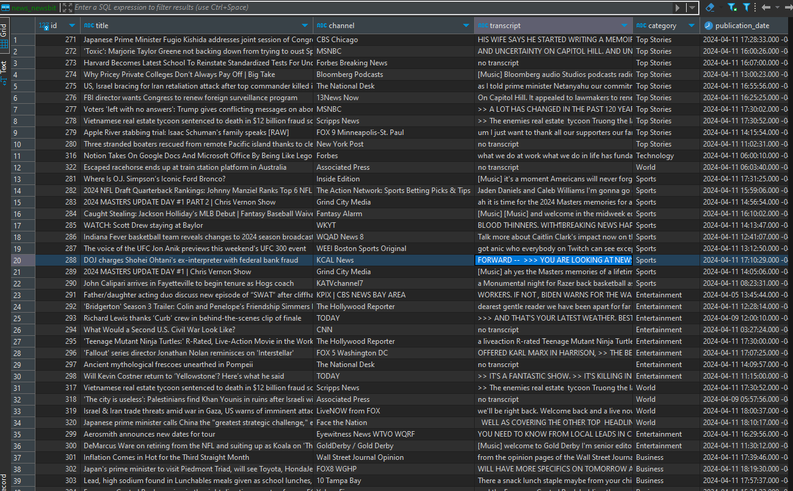
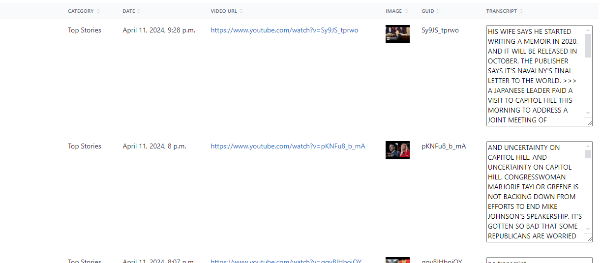
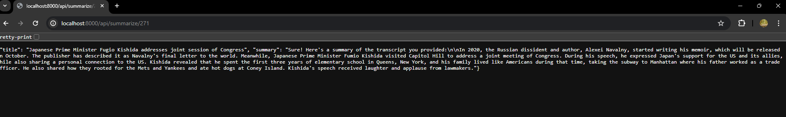
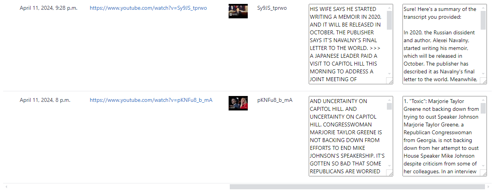
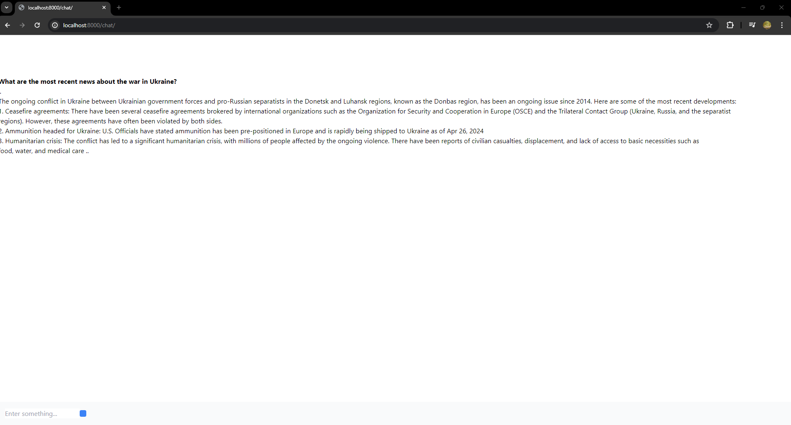

# Yves Nieto
## Milestone 1: Django site

Django-Ninja Running on port 8000 with postgres, redis, celery and Jetstream.



## Milestone 2: Data Model

In order to complete the task I had to make a new app called news. It made a folder with all the .py extensions admin, apps, models, tests, etc
##### Data Model
Here is the data model for the single element newsBit. It contains all the required elements as well as some others.
```
video_url: The URL of the video

transcript: The transcript of the video

channel: The channel of the video

publication_date: The publication date of the video

category: The category of the video
```



##### Admin interface
Here you can see the creation for a newsBit. You're able to view and create them.


##### DBeaver
Here is the DBeaver ER diagram for the entire django application. news_newsbit is the table for each newsBit.


## Milestone 3: YouTube News Mining


In order to get the youtube data you must first attach to the shell using ``` ./run shell``` while being in the project directory.
###### YOU MAY HAVE TO UPDATE THE IP ADDRESS FOR THE JETSTREAM CONSUMER/PUBLISHER AND POSTGRES DATABASE 
navigate to ``` pythonScripts ``` and run the command ``` python getYoutubeURLS.py ```

This should retrieve all the youtube data from the links.txt file.Further implementation in order to run realtime gets should be easy for now using this implementation.

This also publishes the data to the jetstream to be consumed



###### YOU MAY HAVE TO UPDATE THE IP ADDRESS FOR THE JETSTREAM CONSUMER/PUBLISHER AND POSTGRES DATABASE 
Next run ``` python consumer.py ``` for the consumer to consume the data from jetstream and upload it to the postgres database.



If you navigate to [the /latest route.](http://localhost:8000/latest/) you can see the populated table. This will update on changes of database.



## Milestone:4 API

#### Using ollama for /summarize endpoint
attach to the docker container and do ```ollama pull llama3```
This will get the llm, An alternative to openAI llm

with ollama ready I am able to get the transcript for each newsbit and create a summarry api endpoint


this endpoint automatically populates the /latest view 


on the left text box is the original transcript and the right is the summary created by the model.

I used ollama to minimize the cost of usine openAI api. This was good for summarizing 100 videos.

In order to complete the /chat endpoint openAI was necessary

#### OpenAI api to create /chat endpoint

I swaped over openAI as it already had langchain support for RAG.
all the indexing splitting and storing is done in the RAG.py script. 

With this I was able to create a API endpoint to create the chat view.



## Milestone:5

Below is the video demo